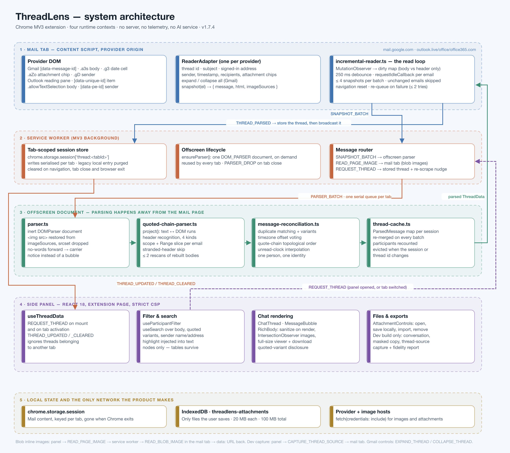

# 01 · System overview



ThreadLens is a Chrome Manifest V3 extension with **four runtime contexts**. The split is not
decoration: each context exists because the one next to it cannot safely or cheaply do its job.

---

## 1. The four contexts

### 1.1 Content script — inside the mail page

`src/content/gmail-scraper.ts`, `src/content/outlook-scraper.ts`, `src/content/incremental-reader.ts`

Runs at the provider's origin (`mail.google.com`, `outlook.live.com`, `outlook.office.com`,
`outlook.office365.com`) because that is the only place the conversation's DOM exists. It is
deliberately the *thinnest* layer in the system: it observes, snapshots and forwards. **No
parsing, no reconciliation and no rendering happen here**, because every millisecond spent in
this context is a millisecond stolen from Gmail's own main thread while the reader is scrolling.

It is also the only context that can resolve a `blob:` URL belonging to the page, which is why
it keeps a small `READ_BLOB_IMAGE` handler (`incremental-reader.ts:180`), and the only context
that can produce a thread-source capture of the provider's own markup (`incremental-reader.ts:113`,
development build only).

### 1.2 Service worker — the router

`src/background/service-worker.ts`

An MV3 background worker: event-driven, killed when idle, with no long-lived state of its own.
It does four things.

1. **Routes** `SNAPSHOT_BATCH` from a content script to the offscreen parser, and relays the
   parsed result straight back as the response (`service-worker.ts:17`).
2. **Owns tab-scoped storage**: `chrome.storage.session['thread:<tabId>']`. Writes are
   serialised per tab through a promise chain (`service-worker.ts:29`) so a fast sequence of
   batches cannot interleave, and `REQUEST_THREAD` waits on that chain before answering.
3. **Manages the offscreen document's lifecycle** — `ensureParser()` creates exactly one,
   on demand, with reason `DOM_PARSER` (`service-worker.ts:10`).
4. **Cleans up**: navigation clears the stored thread, tab close removes it and sends
   `PARSER_DROP` so the parser evicts its cache (`service-worker.ts:63`).

It also gatekeeps the image round trip: `READ_PAGE_IMAGE` is only honoured when the sender is
literally the side-panel page URL (`service-worker.ts:23`), so an arbitrary page cannot use the
extension to read a mail tab's blobs.

### 1.3 Offscreen document — where the thinking happens

`src/offscreen/main.ts`, `src/offscreen/parser.ts`

An invisible extension document whose only purpose is to own a DOM that is **inert**: assigning
`src` to an image loads nothing, a `<script>` never runs, and nothing the email contains can
reach the mail page. Every expensive operation lives here — splitting, reconciling, sorting,
caching — and it runs on a different thread from the mailbox the reader is scrolling.

`main.ts` keeps **one serial promise queue per tab** (`main.ts:3`), so two batches from the same
tab can never interleave inside the cache. `parser.ts` turns each snapshot into messages and
updates the thread cache.

### 1.4 Side panel — the product

`src/side-panel/**`

React 18 under a strict extension CSP. It subscribes to thread updates, filters and searches,
renders the chat, resolves inline images on demand, drives attachment saving, and — in the
development build — writes exports. It never talks to a content script directly except for the
two Gmail controls (`App.tsx:18`), because the side panel's idea of "the current tab" and the
thread's idea of it must agree.

---

## 2. The message protocol

Every cross-context message in the product, in one table. The typed union for the thread
messages lives in `src/types/index.ts:58`.

| Message | From → To | Carries | Notes |
|---|---|---|---|
| `SNAPSHOT_BATCH` | content → worker → offscreen | `{ threadId, subject, client, currentUserEmail, session, snapshots[≤4] }` | The response *is* the parsed `ThreadData`. |
| `PARSER_BATCH` | worker → offscreen | the same batch, plus `tabId` | Queued serially per tab. |
| `PARSER_DROP` | worker → offscreen | `tabId` | Tab closed; evict its cache. |
| `THREAD_PARSED` | content → worker | `ThreadData` | The reader reports the parsed thread; the worker stores and broadcasts it. |
| `THREAD_UPDATED` | worker → panel | `{ data, tabId }` | The panel ignores it unless `tabId` is its own active tab. |
| `CLEAR_THREAD` / `THREAD_CLEARED` | content → worker → panel | `tabId` | Left the thread, or the tab navigated. |
| `REQUEST_THREAD` | panel → worker | — | On mount and on tab activation; also nudges the tab to re-scrape. |
| `SCRAPE_THREAD` | worker → content | — | Re-discover and flush. |
| `EXPAND_THREAD` / `COLLAPSE_THREAD` | panel → content | — | Gmail only; the reader calls the adapter's `expand()` / `collapse()`. |
| `READER_STATS` | any → content | — | Returns the reader's counters; used by the benchmark. |
| `READ_PAGE_IMAGE` | panel → worker | `{ tabId, url }` | Only accepted from the side-panel page. |
| `READ_BLOB_IMAGE` | worker → content | `{ url }` | Refused unless that blob is actually displayed in this thread. |
| `CAPTURE_THREAD_SOURCE` | panel → content | — | **Development build only**; the handler is compiled out of production. |

### Why the parsed thread returns to the content script

`SNAPSHOT_BATCH` is a request/response call whose response is the whole parsed thread, which the
content script then re-sends as `THREAD_PARSED`. That looks like a detour, and it is a
deliberate one: the reader is the only context that knows whether the thread it asked about is
*still* the thread on screen. It compares a `revision` token before forwarding
(`incremental-reader.ts:89`), so a result that arrives after the reader has navigated away is
dropped instead of being written to storage and flashed into the panel.

---

## 3. Who owns which state

| State | Owner | Lifetime | Why there |
|---|---|---|---|
| Snapshots already sent (`WeakMap<Element, MessageSnapshot>`) | content script | until navigation or thread change | Lets the reader skip an unchanged email without re-serialising it. A `WeakMap` means a removed DOM node is collected automatically. |
| Dirty set (`Map<HTMLElement, boolean>`) | content script | until flushed | The boolean is *bodyDirty*: `true` means re-read the body, `false` means headers only. |
| Parsed messages + participants | offscreen `threadCache` | per `tabId:session:threadId` | Reconciliation needs every message seen so far, not just this batch. |
| The current thread per tab | service worker, `chrome.storage.session` | until the tab navigates, closes, or Chrome exits | Session storage is never written to disk and is per-profile. |
| Inline image data URLs | side panel, in memory | session; ≤16 entries, >2 MB dropped | Avoids re-fetching a signature logo repeated in thirty quotes. |
| Saved attachment bytes | side panel, IndexedDB | until removed or the extension is uninstalled | The only thing ThreadLens persists to disk, and only when the reader presses *Save locally*. |

Nothing else is stored. There is no `chrome.storage.local` mail content — the legacy
single-thread entry from an earlier version is actively deleted on every startup
(`service-worker.ts:5`).

---

## 4. The data model

`src/types/index.ts`

```ts
ParsedMessage {
  id, sender, timestamp, body, bodyHtml?, index
  source?: 'direct' | 'quoted'        // from the mailbox, or recovered from a quote
  isCurrentUser, recipients?, attachments?, quotedText?

  timestampEstimated?    // no year, or unparseable — shown as approximate
  timestampZoneUnknown?  // read from a quoted attribution, which records no offset
  orderedByQuote?        // the quote chain placed this, against its own clock
  quotedBy?              // id of the message that quoted this one (reply evidence)
  historyCarrier?        // forwarded with no words of its own
  quotedVariants?        // copies whose wording genuinely differs, kept for inspection
}

ThreadData { threadId, subject, client, scrapedAt, messages[], participants[],
             currentUserEmail?, sourceTabId?, participation? }
```

Five of those fields exist purely so the UI can be honest about uncertainty:
`timestampEstimated`, `timestampZoneUnknown`, `orderedByQuote`, `quotedVariants` and
`participation`. That is the shape of the product: the interesting engineering is not in
displaying a message, it is in being straight about how confident we are that it is *that*
message, sent at *that* time, by *that* person.

---

## 5. End-to-end, in one paragraph

Gmail renders an email. A `MutationObserver` in the content script sees the change, decides
whether the body or only the header moved, and marks the message dirty. 250 ms later — or later
still if the reader is scrolling — the reader wakes, reads each dirty message inside a
`requestIdleCallback`, and produces a snapshot: the message metadata, the body HTML, and the
resolved source of every image in it. Up to four snapshots go to the service worker, which
hands them to the offscreen parser. There, each snapshot is split into the sender's own words
plus every message quoted inside it; the whole set is reconciled against everything already
known about the thread, ordered by the reply chain, and cached. The parsed thread returns to
the reader, which checks it is still current and reports it; the worker stores it against the
tab and broadcasts it; the panel renders it. When a picture scrolls into view, the panel fetches
it — through the mail tab if it is a blob. Nothing else happens until the mailbox changes again.

**Next:** [02 · Thread extraction](02-thread-extraction.md)
