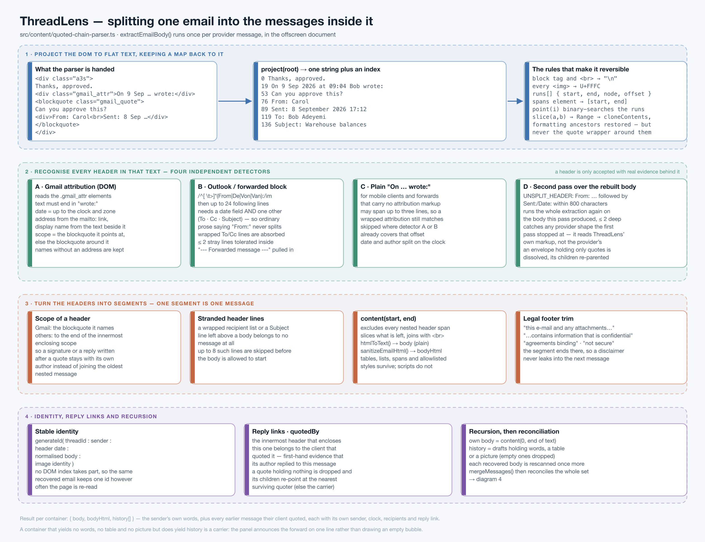

# 03 · Message splitting — one email becomes the messages inside it



**Source:** `src/content/quoted-chain-parser.ts` (the algorithm),
`src/offscreen/parser.ts` (what drives it), `src/content/scraper-utils.ts` (text and HTML
helpers)

This is the feature the product exists for. A single email in an enterprise thread contains
the sender's own words followed by a stack of earlier messages, each introduced by a header
written by whichever client quoted it. Splitting that correctly — without losing formatting,
without cutting a message in half, without inventing a message out of ordinary prose — is the
hardest thing ThreadLens does.

The entry point is `extractEmailBody(bodyEl, currentUserEmail, threadId, anchorTimestamp,
carrierId, depth)` at `quoted-chain-parser.ts:151`. It returns:

```ts
{ body: string,        // the sender's own words, plain text
  bodyHtml: string,    // the same, sanitised HTML
  history: ParsedMessage[] }   // every message recovered from the quotes
```

---

## 1. Why not just split the HTML?

The obvious approach — find `<blockquote>`, treat its contents as the quoted message — fails
immediately on real mail:

- Outlook does not use blockquotes at all. It writes a plain `From: / Sent: / To: / Subject:`
  block and continues in the same element.
- A forwarded Gmail message puts the attribution *outside* the blockquote.
- A header can be split across `<span>`s, table cells and list items by the quoting client.
- An author's own quotation of a document is also a `<blockquote>` and must **not** split.

So ThreadLens works in **text space, with a map back to the DOM**: find the boundaries in text
where they are actually recognisable, then rebuild each segment's *markup* through a DOM `Range`
so tables, lists and styles survive.

---

## 2. Step 1 — `project(root)`

`quoted-chain-parser.ts:14`

A single DOM walk produces three things:

| Output | Shape | Purpose |
|---|---|---|
| `text` | one string | where headers are recognised |
| `runs[]` | `{ start, end, node, offset, image? }` | maps any text offset back to a DOM position |
| `spans` | `Map<Element, [start, end]>` | the text extent of any element |

Rules during the walk:

- a text node contributes its text;
- **every block element** (`DIV P BLOCKQUOTE TR H1–H6 LI PRE HR`) and `<br>` contributes `"\n"`
  before its children, and block elements contribute another after — so `From:` really does
  start a line even when the client wrapped each field in a `<div>`;
- **every `` contributes `U+FFFC`** (object replacement character), so a picture occupies
  exactly one character and never silently joins two words.

One run per text node rather than one object per character: a 200 KB quoted history stays cheap,
and `point(index)` binary-searches the runs (`:39`).

### `slice(start, end)` — the part that preserves formatting

`quoted-chain-parser.ts:45`

1. Trim whitespace at both ends of the requested range.
2. Convert both offsets to DOM positions and build a `Range`.
3. `cloneContents()` into a fresh `<div>`.
4. **Restore the formatting ancestors** that `cloneContents()` dropped. Walking up from the
   range's common ancestor, each element is re-wrapped around the clone — this is what keeps a
   single-cell table a table, a bold span bold, and an `<ol>` item numbered.
5. **With one deliberate exception**: an ancestor matching `blockquote, .gmail_quote` is *not*
   restored (`:65`).

That exception is worth understanding. In a thread twenty replies deep, every client added one
quote wrapper, so restoring them rebuilt a column of twenty empty vertical rules before the
first word of a recovered message. Those wrappers are the quoting client's indentation, not the
author's formatting. A quotation the author wrote *inside* their own message sits within the
segment and is cloned with it, so it is unaffected.

6. Finally the result goes through `sanitizeEmailHtml()` — see
   [09 · Security and privacy](09-security-and-privacy.md).

---

## 3. Step 2 — four header detectors

A "header" is `{ start, end, sender, date, scopeEnd?, recipients? }`. Four independent
detectors contribute, and each is conservative in a different way.

### A · Gmail attribution, from the DOM — `:160`

Gmail marks its attribution with `.gmail_attr`, which is far better evidence than any regex.

- The text must end in `wrote:`.
- The date is everything from `On ` up to the clock (`\d{1,2}:\d{2}(:\d{2})?\s*(AM|PM)?` plus an
  optional `+0100`/`GMT`/`UTC`).
- The address comes from the `mailto:` link; the display name from the text beside it. When
  Gmail links the address and writes the name separately, both are used (`:172`).
- **An author named without an address is kept** as `unknown:<name>` rather than discarded —
  that shape is evidence, and [04](04-reconciliation-and-ordering.md) resolves it to a real
  person when the thread itself provides one.
- The **scope** is the next sibling that is a `blockquote`/`.gmail_quote`, else the one
  enclosing the attribution (`:174`).

### B · Outlook and forwarded header blocks — `:181`

```
/^[ \t>]*(?:From|De|Von|Van):[ \t]*([^\n]+)\n/igm
```

A match is only *accepted* after scanning up to 24 following lines and finding:

- a date field (`Sent|Date|Envoyé|Gesendet|Verzonden`), **and**
- at least one other field (`To|À|An|Aan|Cc|Subject|Objet|Betreff`), **and**
- at least two fields in total.

Without that test, ordinary prose — "From: the warehouse team, here are the figures" — would
split a message in two. Three refinements handle real Outlook output:

1. **Wrapped recipient lists** (`:199`). Outlook wraps a long To/Cc list at whatever column it
   reaches, sometimes between a display name and its own address.
   `isRecipientContinuation()` (`:130`) accepts a line that contains an address and whose
   remainder is empty or a short, capitalised display name (`TRAILING_NAME`, `:118`).
   `recipientsContinue()` (`:137`) decides whether the list is still open.
2. **Stray lines** (`:206`). A hidden element or an inline banner between fields used to reject
   the whole block, showing two emails as one. Up to **two** short (≤80 character) stray lines
   are skipped — but only while the fields plainly continue underneath, and only when the next
   field comes *before* the next `From:`. A field belonging to the next email means this line is
   the message between them, not header noise.
3. **Forward separators** (`:228`). `----- Forwarded message -----` / `----- Original Message -----`
   immediately before the block is absorbed into the header's start, so it never shows up as the
   tail of the previous message.

Recipients found in the To/Cc fields are attached to the recovered message — that is what makes
the participation marker in [04](04-reconciliation-and-ordering.md#7-participation-boundary)
possible for messages nobody's mailbox holds.

### C · Plain `On … wrote:` — `:233`

For mobile clients and forwards that carry no attribution markup:

```
/^[ \t>]*On[ \t]+([^\n]+(?:\n[ \t>]*[^\n]+){0,2}?)\s+wrote:[ \t]*$/igm
```

It may span up to three lines, because a wrapped attribution is common. Matches falling inside a
header already found by A or B are skipped (`:235`).

### D · The second pass — `:148`, `:312`, `:328`

Any single provider shape can defeat the first pass. Rather than chase each one, ThreadLens
re-reads its **own output**:

```
UNSPLIT_HEADER = /^[ \t>]*(?:From|De|Von|Van):[ \t]*\S[^\n]*\n[\s\S]{0,800}?^[ \t>]*(?:Sent|Date|…):/im
```

If a recovered body (or the sender's own body) still contains a complete header block,
`extractEmailBody` runs again on the rebuilt markup, to `MAX_RESCAN_DEPTH = 2`. This catches the
cause-agnostic case: whatever defeated the first pass, the second pass is looking at
ThreadLens's own clean markup instead of the provider's.

One subtlety at `:321`: if the rescanned envelope turns out to hold *nothing but* the emails it
quoted, the envelope is not a message. It is dropped, and its children are re-parented to its
own quoter so the reply chain stays intact.

---

## 4. Step 3 — from headers to segments

### 4.1 Deduplicate and order — `:239`

Headers are sorted by start offset, and any header beginning inside the previous one is dropped.

### 4.2 Resolve scope — `:243`

A Gmail header already knows its scope. For every other header:

```
scopeEnd = min(text.length, …scopeEnd of every header that starts before it and ends after it)
```

In other words, a message ends where its innermost enclosing quote ends. This is why a signature
or a late reply written *after* a quoted block stays with its own author instead of being
appended to the oldest nested message.

### 4.3 Skip stranded header lines — `:254`

When a header block's fields wrapped in a shape the scanner stopped at, its tail — the rest of a
recipient list, the `Subject:` line — is left sitting at the top of the body. Those lines belong
to no message, so `skipStrandedHeader()` consumes up to **8** leading lines that are either
recognised fields or recipient continuations before the body is allowed to begin.

### 4.4 Cut the content — `content(start, end)` at `:267`

1. Skip stranded header lines.
2. Collect every nested header's `[start, min(scopeEnd, end)]` as an **exclusion**.
3. Walk the exclusions in order, appending the text between them.
4. Each appended range is first searched for a **legal footer**:

   ```
   this e-?mail and any attachments | this message contains information that is confidential
   | agreements binding | e-?mail transmissions are not secure
   ```

   and truncated there (`:274`), so a disclaimer never becomes the opening line of the next
   recovered message.
5. Join the pieces with `<br>`, produce `bodyHtml` (sanitised) and `body`
   (`htmlToText()`, `scraper-utils.ts:48`, which preserves paragraphs, line breaks, list bullets
   and table cell tabs, and renders images as `[Image: alt]`).

---

## 5. Step 4 — identity, links and survival

### 5.1 Ids — `:287`

```ts
generateId(`${threadId}:${sender.email}:${date}:${normalisedBody}:${imageIdentity(bodyHtml)}`, 'chain')
```

Content-derived and position-independent, so the same recovered message keeps one id however
many times the page is re-read and in whatever order the mailbox delivers its emails.
`imageIdentity()` (from [04](04-reconciliation-and-ordering.md)) distinguishes two otherwise
identical picture-only messages.

### 5.2 Reply links — `:291`, `:308`

```ts
enclosing[i] = the innermost header that starts before header i and ends after it
quotedBy     = id of that header's message, or the carrier's id at the top level
```

A client nests the email it is answering inside its own, so this is **first-hand evidence of
reply order** — evidence that survives a thread written across timezones, where the clocks do
not. Siblings enclose nothing and stay unordered: only real nesting counts.

If a quote turns out to be empty and is dropped, `quoter()` recurses outward so its children
name the nearest *surviving* quoter — still a message that was certainly sent after them.

### 5.3 What survives — `:305`

```ts
kept[i] = !!(body || /<(?:table|img)\b/i.test(bodyHtml))
```

A message with no words is kept only if it carries a table or a picture. Empty quote shells are
dropped.

### 5.4 Provisional timestamps — `:295`

Each recovered message is dated by `parseEmailDate(header.date, fallback)`, where the fallback
is the carrier's timestamp minus *(i+1)* seconds — so an unparseable date still sorts just
before the email that quoted it, rather than to the end of the thread.

`timestampZoneUnknown` is set when a date **was** parsed from the header and
`hasExplicitTimezone()` (`:88`) found no offset in it. That single flag is what makes the
timezone reconciliation in [04](04-reconciliation-and-ordering.md#4-timezones) possible.

---

## 6. What the caller does with it

`src/offscreen/parser.ts:20`

```ts
const { body, bodyHtml, history } = extractEmailBody(root, batch.currentUserEmail,
                                                     batch.threadId, snapshot.message.timestamp,
                                                     snapshot.message.id);
```

Three outcomes:

| Condition | Result |
|---|---|
| no body, no image, no history, no attachments | nothing at all is emitted |
| no body and no image, but history exists | **carrier**: the direct message is replaced by a one-line notice (`parser.ts:11`) — *"Dana passed this conversation on to Priya and 4 others without adding a message."* — and everything it carried becomes messages in its own right |
| otherwise | the direct message plus its recovered history |

The carrier case matters commercially: a forward with no covering note is still an event in the
conversation, and *who it went to* is exactly what the reader wants to know. Showing an empty
bubble would throw that away.

---

## 7. Known limits

Stated plainly, because they are the honest edges of the feature:

- **Only what is present can be recovered.** History a sender trimmed out of their reply is
  gone; ThreadLens is a reader, not an archive.
- **Inline replies** — text interleaved *inside* an older quoted message rather than above it —
  can remain attached to the message they were written into.
- **Localised headers** are covered for English, French, German and Dutch field labels; date
  parsing still depends on what the browser's `Date.parse` accepts.
- **Sender-edited quotations** are indistinguishable from a different message when the edit is
  large; the copy is then kept separately rather than merged.
- Every one of these degrades into *showing more*, never into showing something false.

**Next:** [04 · Reconciliation and ordering](04-reconciliation-and-ordering.md)
