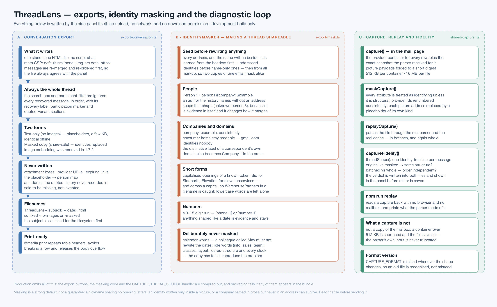

# 08 · Exports, identity masking and the diagnostic loop



**Source:** `src/side-panel/export/*`, `src/shared/capture.ts`,
`src/shared/capture-replay.ts`, `src/side-panel/components/DevDownloads.tsx`

Everything in this document ships **only in the ThreadLens Dev package**. Production omits the
UI, the masking code and the capture handler entirely, and the packager refuses to write a
production ZIP that still contains them ([10](10-build-test-release.md)).

Two different questions are answered here:

- *"What did ThreadLens produce?"* → the **conversation export**.
- *"What did ThreadLens read?"* → the **thread-source capture**.

They are separate files because a parsing bug lives in the second one, and by the time you have
the first, the provider's markup is gone.

---

## 1. Conversation export — `export/conversation.ts`

### What it writes

One standalone HTML file, no script, with its own CSP in a `<meta>` tag:

```
default-src 'none'; img-src data: https:; style-src 'unsafe-inline'; base-uri 'none'; form-action 'none'
```

Every message is re-merged and re-ordered through `mergeMessages()` before writing
(`:22`), so the file cannot disagree with the panel even if it was opened mid-update.
Participation is recomputed the same way.

### What it always contains

- Every recovered message, in order, **regardless of the search box or the participant filter**
  (`:44`). A filtered export would be a quietly incomplete record, and this file is often the
  record somebody keeps.
- Sender name and address — or, where the quoted history never recorded one,
  *"(address not recorded in the quoted history)"* rather than something that looks like a real
  address (`:11`).
- Full date and time, or *"Time unavailable · approximate order"*.
- The labels: *Recovered from quoted history*, *Placed by the quoted reply chain*, *You*.
- The participation marker, quoted variants, additional quoted text and attachment names.
- A footer stating what is and is not in the file, including a sentence about zoneless clocks
  when any message carries one.
- `@media print` rules that repeat table headers, avoid breaking rows and release the body
  overflow, so the file prints as a document.

### What it never contains

Attachment bytes, provider URLs, expiring links, and the placeholder→person map.

### The two forms

| Button | Suffix | Content |
|---|---|---|
| *Text only (no images)* | `-no-images` | `stripImages()` — each picture becomes its filename; a few kilobytes; identical offline |
| *Masked copy (share-safe)* | `-masked` | `maskThread()` first, then stripped; identities replaced |

Image embedding was removed in 1.7.2. Filenames are
`ThreadLens-<subject>-<YYYY-MM-DD><-suffix>.html`, with the subject sanitised for the filesystem
(`:48`).

---

## 2. The identity masker — `export/mask.ts`

The purpose is specific: **hand a real thread to someone helping you diagnose a parsing problem,
without handing them the people in it** — and have the copy still reproduce the problem.

That second half is what makes this harder than redaction. Reconciliation weighs how much text
two copies share, so masking that shortened names inconsistently would change which messages
merge, and the copy would no longer show the bug.

### 2.1 Seed everything before rewriting anything — `:128`, `:424`

Every address, and the display name written beside it, is learned **before a single word is
rewritten**:

1. From message headers — **addressed identities first, name-only ones second**, so an author a
   quote names without an address is recognised as the person the rest of the thread addresses,
   rather than becoming a second placeholder.
2. From recipients, participants and the signed-in address.
3. From all markup: `[email]`, `[data-hovercard-id]`, `[data-address]`, `a[href^="mailto:"]`,
   and any address appearing in prose.

Without this ordering, a display name written *above* the address it belongs to would survive in
the copy masked first and be replaced in the next — which is exactly the difference
reconciliation reads as two different messages.

### 2.2 What each kind of identity becomes

| Real | Masked | Note |
|---|---|---|
| `dana.okafor@elevationservices.co.uk` | `person3@company1.example` | consistent for the life of the export |
| `Dana Okafor`, `Dana`, `okafor` | `Person 3` | the whole name and each part are learned (`:315`) |
| `elevationservices.co.uk` | `company1.example` | and its distinctive label becomes `Company 1` in prose (`:296`) |
| `Elevation`, `Sid` | `Company 1`, `Person 1` | capitalised openings of a known token (`:332`) — including across a capital, so `WarehousePartners` in a filename is caught |
| `+44 7700 900123` | `[phone-1]` | 9–15 digits, shaped like a number to call (`:367`) |
| a bare long digit run | `[number-1]` | an account or reference number |
| `unknown:sarah jones` | `unknown:person 4` | the *shape* is preserved, because it is evidence |
| a message or thread id | `masked-7` | renumbered consistently, so references still point at the same message (`:97`) |
| a link | `https://company2.example/<masked path>?masked` | host mapped, path masked as text, query dropped (`:218`) |
| a picture address | a placeholder **of its own kind** (`:249`) | see below |

### 2.3 What is deliberately *not* masked

- **Calendar words** (`:18`). A colleague called May, June or Marchetti must not rewrite the
  dates in a thread — a timestamp is evidence.
- **Generic and role tokens** (`:10`): `info`, `sales`, `team`, `support`, `ltd`, `the`… —
  replacing them would obscure the thread without protecting anybody.
- **Consumer mail hosts** (`:5`): `gmail.com` identifies nobody.
- **Structural attributes** (`:30`) — class, style, layout, `datetime`, roles: what a scraper
  reads to do its job.
- **Ordinary lowercase words.** Only the capitalised form of a short form is matched, so "the
  car park" stays readable while "Elevation" does not.
- **Every clock, every ordering, every flag, every piece of wording.**

### 2.4 Pictures keep their kind

`imageSource()` (`:249`) replaces a data payload with a short data placeholder, a blob with a
blob, a Gmail proxy token with a proxy token, a proxied address with a proxy address ending in a
masked original, and a `cid:` with a `cid:`. A masked copy that flattened all of these into one
`https` placeholder would merge or separate copies that the original does not — because
`imageKeys()` ([04](04-reconciliation-and-ordering.md#3-pictures-as-evidence)) reads exactly
those distinctions.

### 2.5 `providerHtml()` — masking a provider's own markup — `:187`

For a thread-source capture the rule inverts: **every attribute is treated as identifying unless
it is structural**, because a mail client writes addresses and display names into attributes no
allowlist could predict. Ids go through `id()`, URLs through `url()`, image sources through
`imageSource()`, everything else through `text()`.

### 2.6 The honest limit

Masking is a strong default, not a guarantee. A nickname sharing no opening letters with the
real name, an identity written only inside a picture, and a company named in prose but never in
an address or domain can survive. **Open the file and read it before sending it anywhere** — the
panel says so, and so does the file.

---

## 3. Thread-source capture — `incremental-reader.ts:113`, `export/capture.ts`

### What is captured, per message

```ts
CapturedMessage {
  position,           // its place in the thread's DOM order
  live,               // true = the snapshot the parser actually received
  bodyFound,          // false = a collapsed row that renders no body
  snapshot,           // the parser's own input, image bytes folded
  containerHtml,      // the whole provider container: header row, date cell,
                      // recipient chips, attachment chips
  containerTruncated? // the container was shortened to fit
}
```

Capturing **both** is the point: if the parsed body looks right but the message is wrong, the
problem is in the container; if the container looks right but the body is wrong, the problem is
in the parser. The capture tells the two apart.

Where the reader has already sent a message to the parser, **that very snapshot** is recorded
rather than a fresh reading — the capture is the parser's own input, not a second opinion about
it.

### Budgets — `:10`, `:11`

`CONTAINER_LIMIT` 512 KB per container, `CAPTURE_LIMIT` 16 MB per file. When space runs out the
**container markup yields first and the parser input is never truncated**, and the file records
which containers were shortened. A capture is a diagnostic file, not a copy of the mailbox.

### Folding pictures — `shared/capture.ts:76`

A `data:` payload is replaced by `data:<mime>;base64,folded<digest>`, using a stable 64-bit-ish
FNV-style digest. One payload always folds to one digest and two payloads never collide, so *the
same picture* and *a different picture* read exactly as they did to reconciliation — while the
bytes, which are heavy and can show a face, are gone. Every other kind of source is left
untouched, because each carries its own meaning. `srcset` attributes containing data URLs are
dropped whole rather than half-folded (`:86`).

`CAPTURE_FORMAT` (`:5`) is raised whenever the shape changes, so an old file is recognised
rather than misread.

---

## 4. Replay and fidelity — `shared/capture-replay.ts`

### `replayCapture(capture, { batchSize })` — `:30`

Parses a capture **through the real parser and the real cache**, in batches of
`SNAPSHOT_BATCH_LIMIT` — or, with `batchSize: 0`, all at once. There is no second
implementation to drift out of sync with the product.

### `threadShape(thread)` — `:69`

Reduces a thread to one identity-free line per message:

```
#4 sender=2 time=2026-09-09T08:04:00.000Z source=quoted flags=zoneless+chained
   lines=6 quotedBy=#5 variants=1 recipients=3 attachments=0 images=1,2,1
```

Senders are renumbered by first appearance and pictures are grouped by order of appearance, so
two copies of a thread — one masked, one not — produce **identical** lines if and only if they
parse to the same conversation.

### `captureFidelity(original, masked)` — `:117`

Runs four replays and answers two questions:

| Question | Comparison | Meaning |
|---|---|---|
| Is the masked copy faithful? | original vs masked | masking shortened names; did a body cross one of reconciliation's length thresholds? |
| Is parsing order-independent? | batched vs whole, in **both** copies | the mailbox delivers a thread in pieces, and it must not matter |

The verdict is written into **both files** and shown in the panel before either is saved:

> *The masked copy parses to the same 21 message(s) as the original, with the same order, clocks,
> quote links and pictures.*

If they disagree, the file lists exactly which message and which field moved, and the panel says
to send the original too if that is possible. **Nobody has to assume the masked copy still
reproduces the problem — it is checked.**

---

## 5. The reader's flow — `components/DevDownloads.tsx`

```
Text only (no images)          → ThreadLens-<subject>-<date>-no-images.html
Masked copy (share-safe)       → ThreadLens-<subject>-<date>-masked.html
Report a parsing problem ▸
   Thread source (masked)      → …-source-masked.json      ← send this one
   Thread source (original)    → …-source-original.json    ← keep this one locally
```

Both source copies are always made and always compared, whichever one is saved. Every button
reports its own error and its own progress state.

### Outside the browser

```sh
npm run replay -- ThreadLens-<subject>-<date>-source-masked.json
```

prints how many containers were captured, how many messages came out, whether reading whole and
in batches agree, and one line per message with its sender, clock, variants and attachments.
`artifacts/thread-source-capture.json` is a synthetic example of the format.

---

## 6. How files are written — `export/download.ts`

A `Blob`, an object URL, a synthetic `<a download>` clicked inside the panel's own document, and
a revoke after 30 seconds. **No upload, no network, and no `downloads` permission in the
manifest.**

**Next:** [09 · Security and privacy](09-security-and-privacy.md)
