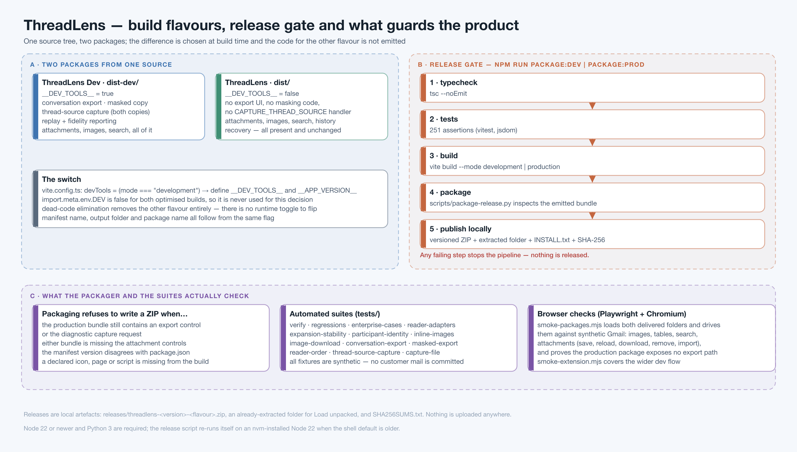

# 10 · Build, test and release



**Source:** `vite.config.ts`, `scripts/release.mjs`, `scripts/package-release.py`,
`scripts/smoke-packages.mjs`, `scripts/smoke-extension.mjs`, `tests/**`

---

## 1. Two packages from one source tree

| | **ThreadLens** (production) | **ThreadLens Dev** |
|---|---|---|
| Build | `npm run package:prod` → `dist/` | `npm run package:dev` → `dist-dev/` |
| `__DEV_TOOLS__` | `false` | `true` |
| Conversation exports | **absent** | text-only and masked |
| Thread-source capture | **absent**, including the content-script handler | masked and original |
| Attachments (open, save, import, download, remove) | present | present |
| Inline images, full-size viewer, **Download image** | present | present |
| History recovery, search, participants, Gmail controls | present | present |
| Name in Chrome and in the panel | ThreadLens | ThreadLens **Dev** |

The difference is decided at build time in `vite.config.ts:9`:

```ts
const devTools = mode === 'development';
define: { __APP_VERSION__: JSON.stringify(pkg.version),
          __DEV_TOOLS__: JSON.stringify(devTools) }
```

Two things are worth being explicit about:

- **`import.meta.env.DEV` is not used for this**, because it is `false` for *both* optimised
  builds. The flag is its own constant.
- Because `__DEV_TOOLS__` is a compile-time literal, dead-code elimination removes the other
  flavour's code entirely. **There is no runtime toggle** — a production build does not contain
  a disabled export button, it contains no export code.

`package.json` is the single source of truth for the version; the manifest is generated from it.
`modulePreload` is disabled because Chrome cannot reuse extension preloads across execution
worlds.

---

## 2. The release gate — `scripts/release.mjs`

`npm run package:prod` (or `:dev`) runs four steps in order and **stops at the first failure**:

| Step | Command |
|---|---|
| 1 · Typecheck | `tsc --noEmit` |
| 2 · Tests | `vitest run` — 251 active assertions |
| 3 · Build | `vite build --mode production` \| `development` |
| 4 · Package | `python3 scripts/package-release.py --prod` \| `--dev` |

It then prints the folder to load unpacked, the ZIP, and the SHA-256.

Node 22 or newer and Python 3 are required; `scripts/node22.mjs` re-executes the release on an
nvm-installed Node 22 when the shell default is older. *(The default Node on this machine is
20.18.2, which the test runner rejects with `ERR_REQUIRE_ESM` — use the nvm v22 toolchain when
running tests by hand.)*

`npm run version:patch|minor|major` bumps the version before starting a release.
`dist/`, `dist-dev/` and `releases/` are git-ignored; packages are local artefacts and nothing is
uploaded anywhere.

---

## 3. What the packager refuses to ship — `scripts/package-release.py`

The packager does not trust the manifest; it reads the **emitted JavaScript**:

```python
code = '\n'.join(p.read_text() for p in dist.rglob('*.js'))

dev_controls = ['Text only (no images)', 'Masked copy (share-safe)',
                'Thread source (masked)', 'Thread source (original, private)',
                'CAPTURE_THREAD_SOURCE']
for control in dev_controls:
    assert (control in code) == args.dev      # present iff this is the dev build

for control in ['Open in email', 'Download saved file', 'Save locally',
                'Choose downloaded file', 'Remove local copy', 'Download image']:
    assert control in code                    # present in BOTH builds
```

It also asserts that the built version matches `package.json`, that the flavour's name is
correct, that every declared script, page and icon exists in the build, and that no
`modulepreload` survived. Then it writes `releases/threadlens-<version>-<flavour>.zip`, an
already-extracted folder, a flavour-specific `INSTALL.txt`, and records the checksum in
`releases/SHA256SUMS.txt`.

The symmetry of that first assertion is the point: a dev control in production **and** a missing
dev control in the dev build both fail the build. A renamed development bundle cannot be
published as production by accident.

---

## 4. The test suites — `tests/`

251 active assertions (one optional capture-file replay is skipped unless
`THREADLENS_CAPTURE` names an input file). **Every fixture is synthetic**; no customer mail is
committed to this repository.

| File | Covers |
|---|---|
| `verify.ts` | the original 35 assertions against the supplied fixtures |
| `regressions.ts` | 40-message histories, short replies, same-prefix content, tables, dates, unsafe markup |
| `enterprise-cases.ts` | duplicates, changed quotes, signature scopes, forwards, recipient evidence, missing years, reconstruction from five direct emails |
| `expansion-stability.ts` | opening an email already present in quoted history must not add a duplicate or a spurious variant — in several orders |
| `reader-adapters.ts`, `reader-order.ts` | adapter behaviour and order-independence |
| `participant-identity.ts` | one person, one identity |
| `inline-images.ts`, `image-download.ts` | image gating, placement, naming, download |
| `conversation-export.ts`, `masked-export.ts` | export content and masking behaviour |
| `thread-source-capture.ts`, `capture-file.ts` | capture format, folding, replay, fidelity |

Coverage by area is tabulated in `TEST_COVERAGE.md`; the narrative history of each defect and its
fix is in `CONTEXT.md`.

### Browser checks

```sh
PLAYWRIGHT_MODULE=/path/to/playwright/index.mjs npm run test:packages
PLAYWRIGHT_MODULE=/path/to/playwright/index.mjs node scripts/smoke-extension.mjs
```

`smoke-packages.mjs` loads **both delivered release folders** into a real Chromium profile and
drives them against synthetic Gmail: images (proxied, blob and data), tables, search,
participants, attachment save/reload/download/remove/import, the image viewer and download — and
asserts that the production package exposes no export path. `smoke-extension.mjs` covers the
wider development flow: thread reconstruction, expansion stability, jump buttons, attachment
persistence across reloads and tab navigation. Screenshots and reports land in
`artifacts/packages-<version>/`.

---

## 5. Installing a build

1. `chrome://extensions` → enable **Developer mode**.
2. **Load unpacked** → select `dist/` (production) or `dist-dev/` (development), or the
   extracted `releases/threadlens-<version>-<flavour>/` folder — the one containing
   `manifest.json`, never the project root.
3. If it is already loaded from that folder, press **Reload**.
4. Refresh the Gmail/Outlook tab, open a conversation, click the toolbar icon (or
   `Alt`+`Shift`+`T`).

Enable only one ThreadLens build at a time while using the mailbox. Reloading an older extension
entry does not change which folder it loads.

---

## 6. Adding a provider

The adapter boundary is the whole extension point. To add a third mail client:

1. Implement `ReaderAdapter` (`src/content/incremental-reader.ts:13`) in a new
   `src/content/<provider>-scraper.ts`: `messageSelector`, `bodySelector`, `threadId`,
   `subject`, `currentUser`, `snapshot`, and optionally `messageElement`, `expand`, `collapse`.
2. Call `startReader(adapter)` at module scope. The loop, batching, capture, blob handling and
   navigation come free.
3. Add the origin to `content_scripts.matches` and `host_permissions` in `manifest.json`, and to
   the attachment allowlist in `storage/attachments.ts:53` if its attachments are fetchable.
4. Extend `ThreadData['client']` in `src/types/index.ts`.
5. Add fixtures and a case to `tests/reader-adapters.ts`.

Nothing in the parser, the reconciler or the UI should need to change: the header detectors in
[03](03-message-splitting.md) are text-shaped, not provider-shaped, which is exactly why a new
client is an adapter and not a rewrite.

---

## 7. Where to look when something is wrong

| Symptom | Start here |
|---|---|
| A message is split in the wrong place, or two emails show as one | [03](03-message-splitting.md) §3 — the detectors; then capture the thread source |
| One email appears twice | [04](04-reconciliation-and-ordering.md) §2–§5 — which piece of evidence failed |
| A reply appears before the message it answers | [04](04-reconciliation-and-ordering.md) §6 — chain edges and `orderedByQuote` |
| The same person is listed twice | [04](04-reconciliation-and-ordering.md) §7 |
| A message is missing | expansion — is the body loaded? — then [02](02-thread-extraction.md) §2 |
| The panel is blank | [07](07-side-panel-ui.md) §1 — tab scoping — and the console filter `[ThreadLens]` |
| An image will not load | [05](05-inline-images.md) §3, §5 — the gate, then the blob round trip |
| An attachment will not save | [06](06-attachments.md) §4, §5 — allowlist, then the HTML-response refusal |

For anything in the first four rows, the fastest route to a fix is
**Report a parsing problem → Thread source (masked)** in the Dev build, then
`npm run replay -- <file>` ([08](08-exports-and-diagnostics.md)).

---

**Back to** [the index](README.md).
