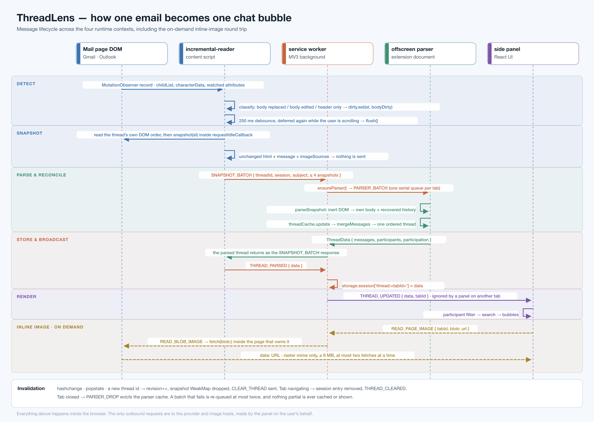
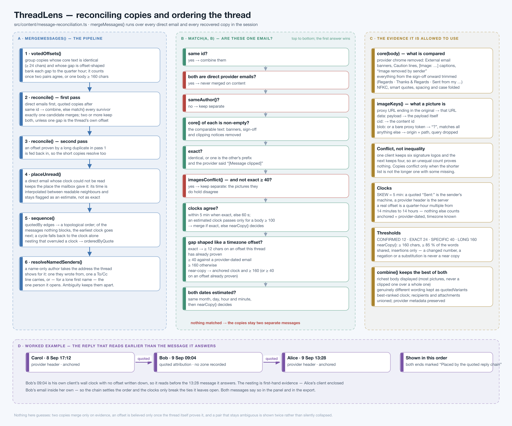
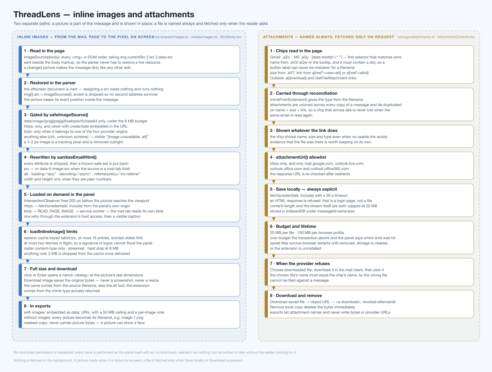

# ThreadLens — architecture and algorithms

**Version 1.7.4 · last reviewed 20 September 2026**

This folder is the engineering reference for ThreadLens: what the product is, how it is put
together, and — in detail — every algorithm behind every feature that ships in production.
It is written for someone joining the team who has never seen the codebase. Read
[01 · System overview](01-system-overview.md) first, then follow whichever pipeline you are
about to touch.

---

## What the product is

A long enterprise email thread is one of the worst reading experiences in software. Forty
replies arrive as five emails, each one carrying the previous thirty-nine inside it, indented
once per reply, with the same message repeated in four slightly different forms. If you joined
the conversation halfway through, the earlier history exists only inside the quotes of the
emails you did receive.

**ThreadLens turns that into a chat.** It reads the conversation the browser has already
rendered, splits every email into the individual messages inside it, works out which of those
are copies of one another, orders them by the reply chain rather than by clocks that were
stamped in different timezones, and shows the result as a WhatsApp-style thread in Chrome's
side panel — with formatting, tables, inline images and attachments intact.

Three commitments shape every design decision in here:

| Commitment | What it rules out |
|---|---|
| **The data never leaves the machine.** | No backend, no telemetry, no AI service, no account. The only network requests are to the reader's own mail provider, for pictures and files they asked for. |
| **Nothing is invented.** | Where the evidence is ambiguous — two copies that might be one message, a name that might be two people, a clock with no timezone — ThreadLens shows both and labels the uncertainty rather than guessing. |
| **The mailbox is not disturbed.** | Reading is passive and incremental. Emails are expanded only when the reader asks, and *Collapse emails again* puts the mailbox back as it was found. |

---

## The diagrams

Each diagram is committed twice: `.svg` (source of truth, editable, scales) and `.png`
(for slides, tickets and anywhere SVG is awkward). Both are generated from the same file.

### 1 · System architecture
The four runtime contexts, what lives in each, and every message that crosses between them.


### 2 · Message lifecycle
One email, from the DOM mutation that reveals it to the bubble on screen — including the
on-demand inline-image round trip and every invalidation path.



### 3 · Message splitting
How one provider email becomes the several messages quoted inside it: text projection, four
header detectors, scope resolution, range slicing and the second pass.


### 4 · Reconciliation and ordering
How copies of one message are recognised as one, how a timezone offset is proved, and why the
quote nesting outranks the clocks.



### 5 · Inline images and attachments
The two media paths: a picture is part of the message; a file is named always and fetched only
when asked for.



### 6 · Exports, masking and diagnostics
The development-build export paths, how a thread is made shareable, and how a masked copy is
proved to still reproduce the problem it was exported for.


### 7 · Build, release and what guards the product
Two packages from one source tree, the release gate, and the checks that stop a production
build shipping a development control.


---

## The documents

| # | Document | Covers |
|---|---|---|
| 01 | [System overview](01-system-overview.md) | Runtime contexts, the message protocol, state ownership, the data model, why the design is shaped this way |
| 02 | [Thread extraction](02-thread-extraction.md) | The incremental reader, mutation classification, batching, provider adapters, timestamps, recipients, navigation |
| 03 | [Message splitting](03-message-splitting.md) | `extractEmailBody()` in full: projection, the four header detectors, scopes, slicing, footers, ids, reply links, recursion |
| 04 | [Reconciliation and ordering](04-reconciliation-and-ordering.md) | Duplicate matching, provider noise, pictures as evidence, timezone offset voting, chain ordering, one-person-one-identity, participation |
| 05 | [Inline images](05-inline-images.md) | Capture, restoration, the safety gate, lazy loading, the blob round trip, the viewer, downloading, export behaviour |
| 06 | [Attachments](06-attachments.md) | Chip scraping, metadata survival, the host allowlist, local saving, budgets, manual import, removal |
| 07 | [Side panel UI](07-side-panel-ui.md) | Thread subscription, filtering, search, bubble rendering, carrier notices, variants, participation marker, keyboard and jump controls |
| 08 | [Exports and diagnostics](08-exports-and-diagnostics.md) | Conversation export, the identity masker, thread-source capture, replay and the fidelity check |
| 09 | [Security and privacy](09-security-and-privacy.md) | Sanitisation, CSP, permissions, trust boundaries, data residency, the threat model and its honest limits |
| 10 | [Build, test and release](10-build-test-release.md) | Build flavours, the release gate, the packager's refusals, the test suites, how to add a provider |

---

## Source map

```
src/
├── content/                    runs inside the mail page (provider origin)
│   ├── gmail-scraper.ts        Gmail ReaderAdapter — selectors, expand/collapse, attachment chips
│   ├── outlook-scraper.ts      Outlook ReaderAdapter — reading pane, sender strategies
│   ├── incremental-reader.ts   the read loop: observe → classify → snapshot → batch → send
│   ├── message-metadata.ts     recipients (header-scoped) and timestamps (attributes first)
│   ├── scraper-utils.ts        sender identity, HTML → text, the sanitiser, stable ids
│   ├── quoted-chain-parser.ts  splitting one email into the messages inside it
│   ├── message-reconciliation.ts  duplicate matching, timezone offsets, ordering, identity
│   └── thread-cache.ts         per-session message map and participant counts
├── background/service-worker.ts   routing, tab-scoped session storage, offscreen lifecycle
├── offscreen/                  an inert extension document: all parsing happens here
│   ├── main.ts                 one serial queue per tab
│   └── parser.ts               snapshot → messages, carrier notices, cache update
├── shared/                     used by more than one context
│   ├── snapshots.ts            the reader → parser contract
│   ├── images.ts               the image safety gate and the raster reader
│   ├── capture.ts              thread-source capture format and the picture fold
│   └── capture-replay.ts       replay, thread shape, masked-copy fidelity
├── side-panel/                 the React UI (extension page)
│   ├── App.tsx, hooks/, components/, media/, storage/, export/, styles/
└── types/index.ts              ParsedMessage, ThreadData, the extension message union
```

## Conventions used in these documents

- Code is referenced as `path/to/file.ts:line` — clickable in most editors.
- "Direct" means an email the mailbox itself holds. "Recovered" or "quoted" means a message
  reconstructed from the history quoted inside one of those emails.
- "Anchored" means a timestamp the provider dated, read in the reader's own timezone.
- Numbers quoted as limits (8 MB, 20 MB, 160 characters…) are the constants actually in the
  source; each is named where it is introduced.
